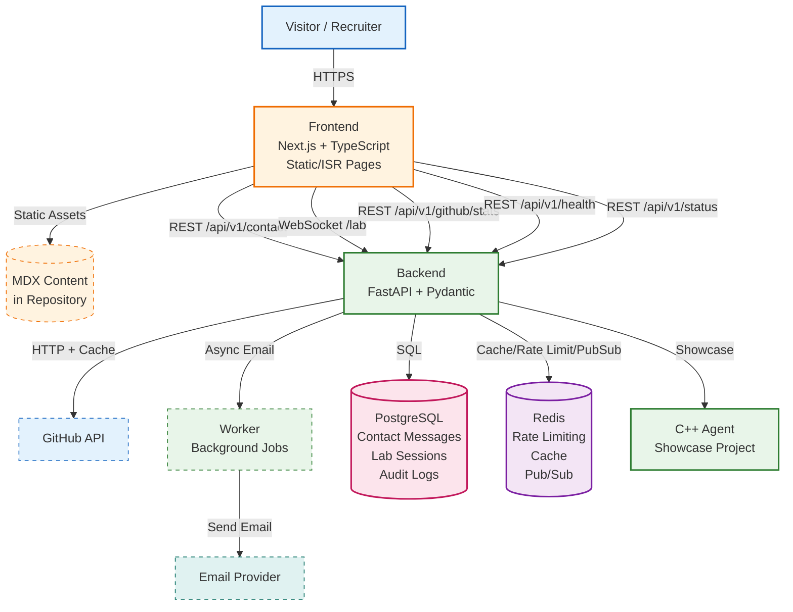

# Blue-Sentinel Portfolio Architecture Overview

## System Context

Blue-Sentinel is a personal portfolio website showcasing Cybersecurity/Blue Team expertise and development skills. The site is a static-first Next.js application with a minimal FastAPI backend for dynamic features (contact form, interactive detection lab, GitHub stats).

## Architecture Diagram



## Core Flows

### 1. Static Site Delivery (Primary)
- **Visitor** requests pages (`/`, `/about`, `/projects`, `/writing`, `/lab`, `/status`)
- **Frontend** serves pre-rendered static HTML (SSG) or ISR pages from CDN/edge
- **No backend dependency** — site works entirely without FastAPI running
- Content authored in **MDX** files co-located in the repository

### 2. Contact Form Submission
- **Visitor** fills form on `/contact` → `POST /api/v1/contact`
- **Backend** validates (Zod/Pydantic), checks rate limit (Redis), runs anti-spam heuristics
- Persists message to **PostgreSQL** (`contact_messages` table)
- **Worker** picks up job from Redis queue → sends email via provider (SendGrid/Resend/SMTP)
- Returns `202 Accepted` immediately (async email delivery)

### 3. Interactive Detection Lab (`/lab`)
- **Visitor** opens `/lab` → Frontend establishes **WebSocket** to `ws://backend:8000/api/v1/lab/ws`
- **Backend** generates **synthetic security events** (process exec, network conn, file write, etc.)
- **Detection Engine** evaluates events against Sigma-like rules → produces alerts
- Alerts streamed in real-time via WebSocket → displayed in SOC-style dashboard
- Session state in Redis; audit log in PostgreSQL

### 4. GitHub Statistics
- **Backend** cron job (or on-demand) calls **GitHub API** (repos, stars, commits, languages)
- Response cached in **Redis** with TTL (default 1 hour)
- **Frontend** reads cached stats via `GET /api/v1/github/stats`
- Graceful degradation: stale cache served if GitHub API unavailable

### 5. System Status Page (`/status`)
- **Frontend** calls `GET /api/v1/status` → **Backend** collects:
  - CPU, RAM, disk usage (psutil)
  - PostgreSQL latency (pg_isready timing)
  - Redis latency (PING timing)
  - Uptime, version, environment
- Returns JSON for frontend dashboard display

### 6. Health Checks
- `GET /api/v1/health/live` — liveness (process alive)
- `GET /api/v1/health/ready` — readiness (PostgreSQL + Redis reachable)
- Used by Docker healthchecks, load balancers, orchestration

## Architecture Principles

- **Static-first**: Core portfolio pages are static HTML; backend only for dynamic features
- **Resilient**: Site functions fully with backend offline (contact/lab/status unavailable gracefully)
- **Defensive & Educational**: Detection lab uses synthetic events only; no real telemetry
- **Observable**: Structured JSON logs, health endpoints, metrics (`/metrics` for Prometheus)
- **Secure by Default**: Separate Docker networks, no exposed DB/Redis ports, non-root containers, secrets via env/Docker secrets
- **No Secrets in Code**: All credentials via `.env` / `.env.example` / Docker secrets
- **Async by Default**: Contact emails, lab events processed async via Redis queues

## Technology Matrix

| Layer | Technology | Purpose |
|-------|------------|---------|
| Frontend | Next.js 14, TypeScript, Tailwind CSS | Static/ISR site, MDX content, WebSocket client |
| Backend | FastAPI, Pydantic, SQLAlchemy 2.0 | REST API, WebSocket, validation, ORM |
| Database | PostgreSQL 16 | Contact messages, lab sessions, audit |
| Cache/Queue | Redis 7 | Rate limiting, GitHub stats cache, pub/sub, email queue |
| Worker | Python + Redis Queue | Background email sending, cleanup jobs |
| Agent Showcase | C++20, CMake | Portfolio project demonstrating systems programming |
| Containerization | Docker, Docker Compose | Reproducible dev/prod environments |
| CI/CD | GitHub Actions | Lint, test, build, deploy |

## Network Topology

```
┌─────────────────────────────────────────────────────────────┐
│                     frontend-net (public)                   │
│  ┌──────────────┐                                           │
│  │   Frontend   │◄────── Visitor (port 3000)                │
│  │  (Next.js)   │                                           │
│  └──────┬───────┘                                           │
└─────────│───────────────────────────────────────────────────┘
          │ Internal HTTP/WebSocket
┌─────────▼───────────────────────────────────────────────────┐
│                     backend-net (internal)                  │
│  ┌──────────┐  ┌────────┐  ┌──────────┐  ┌──────────────┐  │
│  │ Backend  │  │ Worker │  │PostgreSQL│  │    Redis     │  │
│  │(FastAPI) │  │        │  │  (16)    │  │    (7)       │  │
│  └──────────┘  └────────┘  └──────────┘  └──────────────┘  │
└─────────────────────────────────────────────────────────────┘
```
- **frontend-net**: External access (port 3000), connects to backend
- **backend-net**: Internal only (`internal: true`), no external ports
- PostgreSQL and Redis **never exposed** to host/outside
- Backend connects to both networks; Frontend only to frontend-net

## Deployment Notes

- `docker compose up` brings up all services with health checks
- Production: Use Docker secrets for passwords, reverse proxy (Traefik/Caddy) for TLS
- Frontend builds to standalone output for minimal container size
- Backend runs as non-root user `appuser` (UID 1000)
- Frontend runs as non-root user `nextjs` (UID 1001)