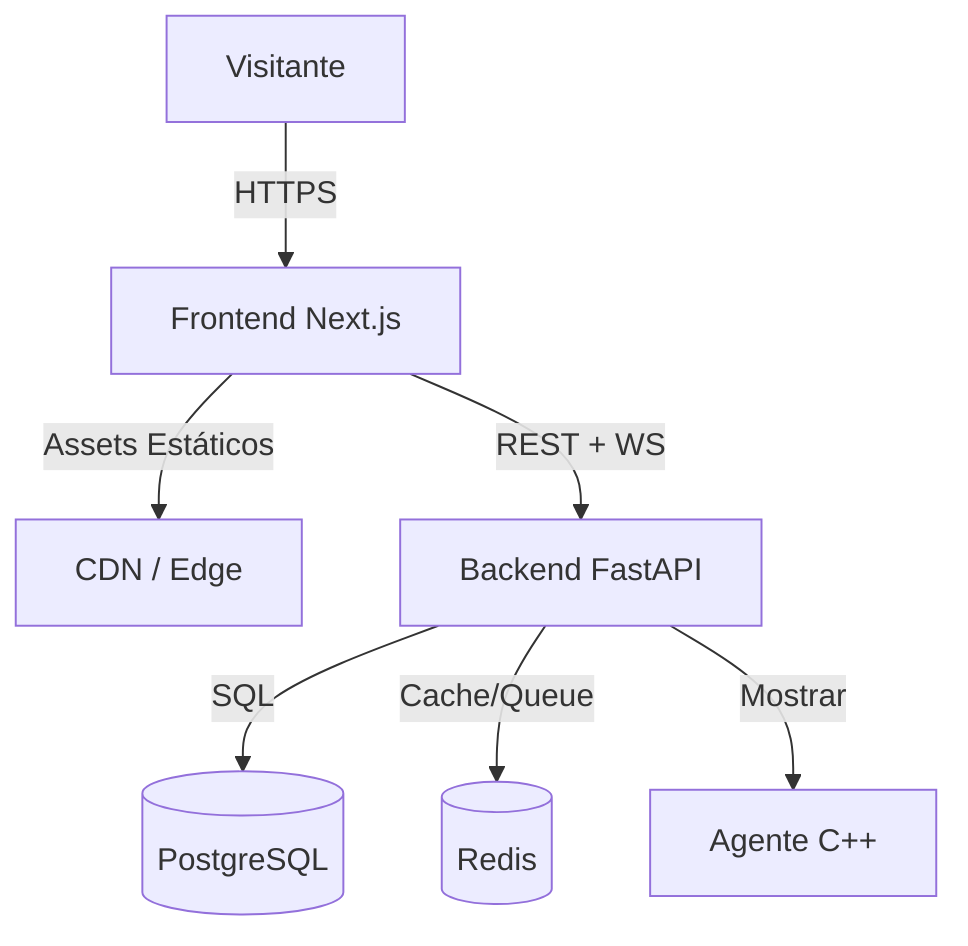

# Plataforma de Portfólio Blue-Sentinel

Um portfólio completo mostrando expertise em Blue Team / Detection Engineering. Construído como aplicação full-stack com frontend Next.js static-first e backend FastAPI para recursos dinâmicos.

## Declaração de Problema

Portfólios tradicionais são estáticos — mostram *o que* você fez mas não *como* você pensa. Para um engenheiro de segurança, demonstrar capacidades de detecção em tempo real, métricas interativas e laboratórios fornece muito mais sinal do que um resumo em PDF.

## Arquitetura



### Escolhas de Tecnologia

| Camada | Tecnologia | Justificativa |
|--------|------------|---------------|
| Frontend | Next.js 14, TypeScript, Tailwind | SSG/ISR, excelente DX, ecossistema React |
| Backend | FastAPI, Pydantic, SQLAlchemy 2.0 | Async, OpenAPI automático, ecossistema Python |
| Database | PostgreSQL 16 | ACID, JSONB, madura, confiável |
| Cache/Queue | Redis 7 | Latência sub-ms, pub/sub, streams, TTL |
| Agente | C++20, CMake, eBPF/ETW | Performance, cross-platform, systems programming |

## Recursos Principais

### 1. Portfólio Static-First

Todas as páginas principais (`/`, `/about`, `/projects`, `/writeups`, `/security`, `/resume`) são **pré-renderadas no build time** (SSG) ou usam **Incremental Static Regeneration** (ISR). O site funciona completamente sem o backend rodando.

```typescript
// next.config.js
output: 'standalone', // Imagem Docker mínima
images: { formats: ['image/avif', 'image/webp'] },
```

### 2. Laboratório de Detecção Interativo (`/lab`)

Conexão WebSocket em tempo real com backend que gera **eventos de segurança sintéticos** e os avalia contra regras Sigma-like.

<Callout type="info" title="Eventos Sintéticos">
Todos os eventos do lab são **sintéticos** — gerados programaticamente para demonstração. Nenhum telemetry real, nenhum dado de produção.
</Callout>

```python
# backend/app/detection/engine.py
class DetectionEngine:
    async def evaluate(self, event: Event) -> List[Alert]:
        for rule in self.rules:
            if rule.matches(event):
                yield Alert(rule=rule, event=event, severity=rule.severity)
```

### 3. Status em Tempo Real (`/status`)

Painel de métricas ao vivo mostrando CPU, memória, disco, rede e saúde de serviços (PostgreSQL, Redis, endpoints de API).

### 4. Formulário de Contato com Anti-Spam

- Validação Zod + Pydantic
- Rate limiting Redis (janela deslizante)
- Campo honeypot
- Email assíncrono via worker

## Engenharia de Detecção em Destaque

O lab demonstra **7 regras Sigma ativas** que cobrem:

| Regra | Técnica MITRE | Status |
|------|--------------|--------|
| PowerShell EncodedCommand | T1059.001 | ✅ Ativa |
| Suspicious Network Connection | T1071.001 | ✅ Ativa |
| Ingress Tool Transfer | T1105 | ✅ Ativa |
| Registry Run Key Persistence | T1547.001 | ✅ Ativa |
| System Information Discovery | T1082 | ⏸️ Inativa |
| DNS Exfiltration | T1071.004 | ⏸️ Inativa |
| Credential Dumping | T1003 | ⏸️ Inativa |

## Segurança por Design

- **Segmentação de rede**: Redes Docker separadas (`frontend-net` pública, `backend-net` interna)
- **Portas de DB não expostas**: PostgreSQL e Redis apenas acessíveis dentro do `backend-net`
- **Containers não-root**: Todos os serviços rodam como usuários não privilegiados
- **Segredos via env**: `.env.example` com placeholders, Docker secrets em produção
- **Rate limiting**: Todos os endpoints públicos protegidos
- **Log estruturado**: JSON logs para trilha de auditoria

## Deploy

```bash
# Desenvolvimento
docker compose -f docker-compose.yml -f docker-compose.override.yml up

# Produção
docker compose up --build -d
```

### Verificações de Saúde

```bash
# Liveness
curl http://localhost:8000/api/v1/health/live
# {"status": "alive"}

# Readiness (verifica DB + Redis)
curl http://localhost:8000/api/v1/health/ready
# {"status": "ready", "checks": {"postgres": "healthy", "redis": "healthy"}}
```

## Lições Aprendidas

1. **Static-first paga o retorno**: 99th percentile page loads < 100ms. Backend pode estar fora do ar e o portfólio ainda funciona.
2. **Python para detecção**: Ecossistema Sigma está maduro em Python. Reescrever em Go/Rust seria meses de trabalho.
3. **WebSocket para lab**: Server-sent events ou polling adicionariam complexidade. WebSocket nativo é limpo.
4. **Redis streams > lists**: Para a fila de e-mail, streams proporcionam semântica exactly-once e consumer groups.

## Trabalhos Futuros

- [ ] Visualização Three.js SOC no hero
- [ ] Heatmap de cobertura MITRE ATT&CK
- [ ] Playground de teste de regras (YARA + Sigma)
- [ ] Lab multi-tenant para demos de equipe

---

*Construído com ♥ para a comunidade Blue Team. Todo código de código aberto sob licença MIT.*