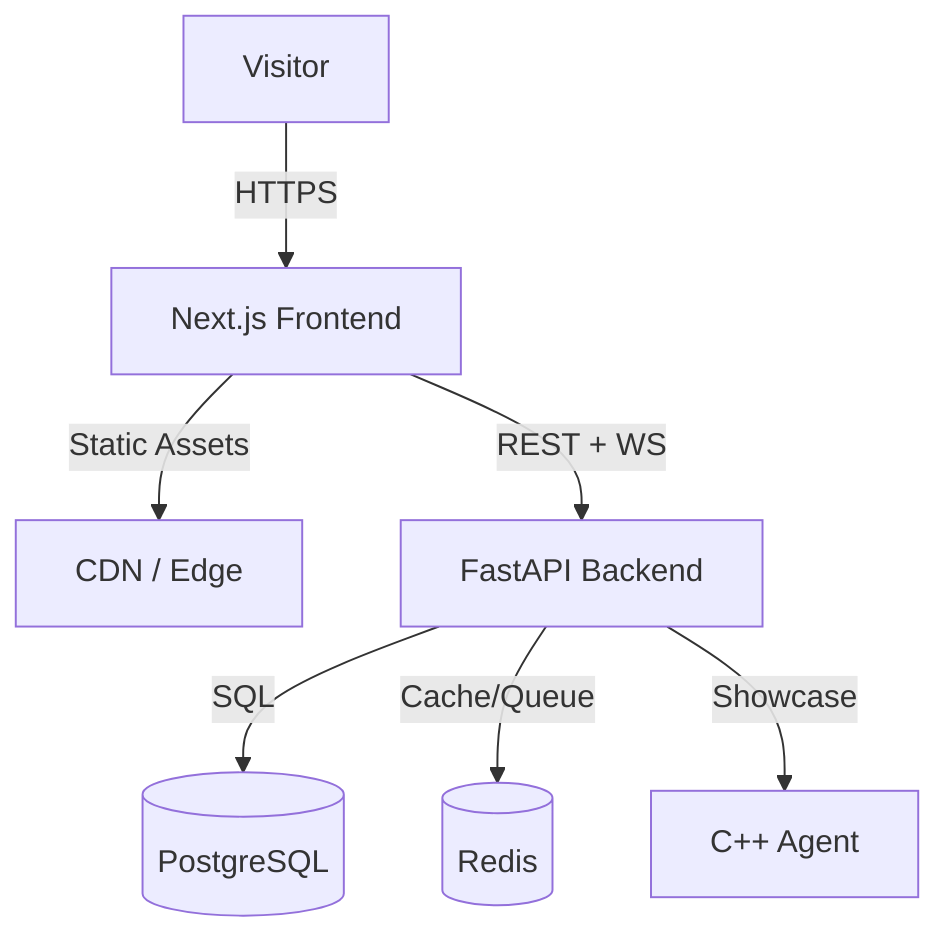

# Blue-Sentinel Portfolio Platform

A complete portfolio platform showcasing Blue Team / Detection Engineering expertise. Built as a **full-stack application** with a static-first Next.js frontend and a FastAPI backend for dynamic features.

## Problem Statement

Traditional portfolios are static — they show *what* you've done but not *how* you think. For a security engineer, demonstrating real-time detection capabilities, live metrics, and interactive labs provides far more signal than a PDF resume.

## Architecture



### Technology Choices

| Layer | Technology | Rationale |
|-------|------------|-----------|
| Frontend | Next.js 14, TypeScript, Tailwind | Static/ISR, excellent DX, React ecosystem |
| Backend | FastAPI, Pydantic, SQLAlchemy 2.0 | Async, auto OpenAPI, Python security ecosystem |
| Database | PostgreSQL 16 | ACID, JSONB, mature, reliable |
| Cache/Queue | Redis 7 | Sub-ms latency, pub/sub, streams, TTL |
| Agent | C++20, CMake, eBPF/ETW | Performance, cross-platform, systems programming |

## Key Features

### 1. Static-First Portfolio

All core pages (`/`, `/about`, `/projects`, `/writeups`, `/security`, `/resume`) are **pre-rendered at build time** (SSG) or use **Incremental Static Regeneration** (ISR). The site works completely without the backend running.

```typescript
// next.config.js
output: 'standalone', // Minimal Docker image
images: { formats: ['image/avif', 'image/webp'] },
```

### 2. Interactive Detection Lab (`/lab`)

Real-time WebSocket connection to backend that generates **synthetic security events** and evaluates them against Sigma-like detection rules.

<Callout type="info" title="Synthetic Events Only">
All events in the lab are **synthetic** — generated programmatically for demonstration. No real telemetry, no production data.
</Callout>

```python
# backend/app/detection/engine.py
class DetectionEngine:
    async def evaluate(self, event: Event) -> List[Alert]:
        for rule in self.rules:
            if rule.matches(event):
                yield Alert(rule=rule, event=event, severity=rule.severity)
```

### 3. Real-Time System Status (`/status`)

Live metrics dashboard showing CPU, memory, disk, network, and service health (PostgreSQL, Redis, API endpoints).

### 4. Contact Form with Anti-Spam

- Zod + Pydantic validation
- Redis rate limiting (sliding window)
- Honeypot field
- Async email via background worker

## Detection Engineering Showcase

The lab demonstrates **7 active Sigma rules** covering:

| Rule | MITRE Technique | Status |
|------|----------------|--------|
| PowerShell EncodedCommand | T1059.001 | ✅ Active |
| Suspicious Network Connection | T1071.001 | ✅ Active |
| Ingress Tool Transfer | T1105 | ✅ Active |
| Registry Run Key Persistence | T1547.001 | ✅ Active |
| System Information Discovery | T1082 | ⏸️ Inactive |
| DNS Exfiltration | T1071.004 | ⏸️ Inactive |
| Credential Dumping | T1003 | ⏸️ Inactive |

## Security by Design

- **Network segmentation**: Separate Docker networks (`frontend-net` public, `backend-net` internal)
- **No exposed DB ports**: PostgreSQL and Redis only accessible within `backend-net`
- **Non-root containers**: All services run as unprivileged users
- **Secrets via env**: `.env.example` with placeholders, Docker secrets in production
- **Rate limiting**: All public endpoints protected
- **Structured logging**: JSON logs for audit trail

## Deployment

```bash
# Development
docker compose -f docker-compose.yml -f docker-compose.override.yml up

# Production
docker compose up --build -d
```

### Health Checks

```bash
# Liveness
curl http://localhost:8000/api/v1/health/live
# {"status": "alive"}

# Readiness (checks DB + Redis)
curl http://localhost:8000/api/v1/health/ready
# {"status": "ready", "checks": {"postgres": "healthy", "redis": "healthy"}}
```

## Lessons Learned

1. **Static-first pays off**: 99th percentile page loads < 100ms. Backend can be down and portfolio still works.
2. **Python for detection**: Sigma ecosystem is mature in Python. Rewriting in Go/Rust would be months of work.
3. **WebSocket for lab**: Server-sent events or polling would add complexity. Native WebSocket is clean.
4. **Redis streams > lists**: For the email queue, streams provide exactly-once semantics and consumer groups.

## Future Work

- [ ] Three.js SOC visualization in hero
- [ ] MITRE ATT&CK coverage heatmap
- [ ] Rule testing playground (YARA + Sigma)
- [ ] Multi-tenant lab for team demos

---

*Built with ♥ for the Blue Team community. All code open source under MIT license.*