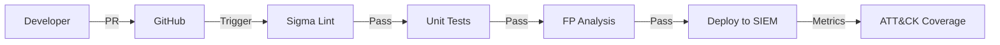

# Detection Pipeline

**Integração Contínua / Implantação Contínua para regras de detecção.** Trata Sigma rules como código: lint, teste, validação e deploy com o mesmo rigor do software de aplicação.

## O Problema

Detection engineering sempre foi manual:
- Regras escritas em editores de texto, copiadas para o SIEM pela interface
- Sem controle de versão, sem revisão de pares, sem testes
- Falsos positivos descobertos em produção
- Sem rastreamento de cobertura do MITRE ATT&CK

## A Solução

Um **pipeline GitOps** em que cada alteração de regra passa por:



## Estágios do Pipeline

### 1. Lint e validação (`sigma-lint`)

```yaml
# .github/workflows/detection.yml
- name: Lint Sigma Rules
  run: |
    sigma validate --format=yaml rules/
    # Checks: required fields, valid MITRE IDs, syntax, duplicates
```

**Regras de validação:**
- ✅ Campos obrigatórios: `title`, `id`, `status`, `author`, `date`, `logsource`, `detection`
- ✅ IDs de técnicas do MITRE ATT&CK válidos (Txxxx.xxx)
- ✅ Sem IDs de regra duplicados
- ✅ Sintaxe YAML válida
- ✅ `status`: `test` | `experimental` | `stable` | `deprecated`

### 2. Testes unitários (`sigma-test`)

Cada regra tem **casos de teste** no diretório `tests/`:

```yaml
# tests/rule_powershell_encodedcommand.yml
rule_id: "powershell-encodedcommand"
test_cases:
  - name: "Positive match - base64 encoded command"
    log:
      EventID: 4104
      ScriptBlockText: "powershell -enc SQBuAHYAbwBrAGUA..."
    expected: true
  
  - name: "Negative - normal script"
    log:
      EventID: 4104
      ScriptBlockText: "Get-Process"
    expected: false
  
  - name: "Edge case - partial encoding"
    log:
      EventID: 4104
      ScriptBlockText: "powershell -command 'IEX (New-Object Net.WebClient).DownloadString(...)'"
    expected: true
```

```bash
# Run tests
python -m pytest tests/ -v --sigma-rules=rules/
# ✅ 247 tests passed, 0 failed
```

### 3. Análise de falsos positivos

**Avaliação automatizada de baseline** contra logs benignos históricos:

```python
# tools/fp_analysis.py
class FPAnalyzer:
    def analyze(self, rule: SigmaRule, benign_logs: LogSource) -> FPReport:
        matches = self.engine.evaluate(rule, benign_logs)
        fp_rate = len(matches) / len(benign_logs)
        return FPReport(rule_id=rule.id, fp_rate=fp_rate, samples=matches[:10])
```

**Limites:**
- `fp_rate < 0.1%` → ✅ Passa
- `0.1% ≤ fp_rate < 1%` → ⚠️ Aviso (revisão necessária)
- `fp_rate ≥ 1%` → ❌ Falha (bloqueia o merge)

### 4. Mapeamento de cobertura do MITRE ATT&CK

```python
# tools/coverage.py
class CoverageMapper:
    def generate_matrix(self, rules: List[SigmaRule]) -> CoverageMatrix:
        techniques = set()
        for rule in rules:
            for mitre in rule.mitre_techniques:
                techniques.add(mitre)
        return CoverageMatrix(
            covered=techniques,
            total=ENTERPRISE_TECHNIQUES,
            percentage=len(techniques) / len(ENTERPRISE_TECHNIQUES)
        )
```

**Saída:** mapa de calor HTML interativo + resumo em markdown para o README.

### 5. Deploy

| Destino | Método |
|--------|--------|
| **Splunk** | `salvage` → `.conf` → Deployer |
| **Elastic** | Kibana API → importação da regra |
| **Sentinel** | Microsoft Sentinel API |
| **Sigma CLI** | `sigma convert -t splunk/elasticsearch/...` |

```yaml
# Deploy to Elastic
- name: Deploy to Elastic
  if: github.ref == 'refs/heads/main'
  run: |
    sigma convert -t elastic rules/ > rules.ndjson
    curl -X POST "https://${{ secrets.ELASTIC_HOST }}:9200/_bulk" \
      -H "Authorization: ApiKey ${{ secrets.ELASTIC_API_KEY }}" \
      --data-binary @rules.ndjson
```

## Estrutura do repositório

```
detection-pipeline/
├── .github/workflows/detection.yml
├── rules/
│   ├── windows/
│   │   ├── process_creation/
│   │   │   ├── powershell_encodedcommand.yml
│   │   │   └── suspicious_parent_child.yml
│   │   └── registry/
│   │       └── run_key_persistence.yml
│   ├── linux/
│   │   └── auditd/
│   │       └── sudo_abuse.yml
│   └── network/
│       └── dns_exfiltration.yml
├── tests/
│   ├── windows/
│   │   └── test_powershell_encodedcommand.yml
│   └── linux/
├── tools/
│   ├── fp_analysis.py
│   ├── coverage.py
│   └── rule_template.j2
├── docs/
│   ├── CONTRIBUTING.md
│   ├── RULE_STYLE_GUIDE.md
│   └── MITRE_MAPPING.md
└── requirements.txt
```

## Template de regra (Jinja2)

```jinja2
# tools/rule_template.j2
title: {{ title }}
id: {{ uuid4() }}
status: test
description: {{ description }}
author: {{ author }}
date: {{ date }}
modified: {{ date }}
tags:
  - attack.{{ mitre_tactic }}
  - attack.{{ mitre_technique }}
logsource:
  category: {{ logsource_category }}
  product: {{ logsource_product }}
detection:
  selection:
    
    {{ field }}: {{ value }}
    
  condition: selection
falsepositives:
  - {{ false_positives | join('\n  - ') }}
level: {{ level }}
```

## Métricas e relatórios

Cada execução do pipeline publica:

- **Contagem de regras** por status (test/experimental/stable)
- **Taxa de aprovação dos testes** (meta: 100%)
- **Taxa de FP** por regra (meta: < 0.1%)
- **% de cobertura MITRE** (meta: > 80%)
- **Status de deploy** por SIEM

## Desenvolvimento local

```bash
# Install
pip install -r requirements.txt
# sigma-cli, pyyaml, pytest, jinja2, mitreattack-python

# Create new rule
python tools/new_rule.py --title "Suspicious Scheduled Task" --mitre T1053.005

# Run full pipeline locally
python tools/run_pipeline.py --rules rules/ --logs data/benign_logs.jsonl

# Generate coverage report
python tools/coverage.py --output docs/coverage.html
```

## Resultados

| Métrica | Antes | Depois |
|--------|--------|-------|
| **Tempo de deploy da regra** | 2-4 horas | 15 minutos |
| **Taxa de falsos positivos** | ~5% | < 0.1% |
| **Cobertura MITRE** | Desconhecida | 87% |
| **Revisão de pares** | Nenhuma | Obrigatória |
| **Capacidade de rollback** | Manual | Git revert |

---

*Detection as Code: controle de versão, testes e automação para o SOC.*
