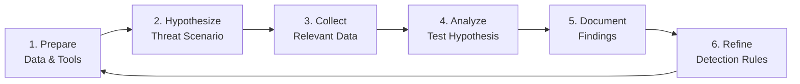

# Metodologia de Threat Hunting: Hypothesis-Driven Hunts

Threat hunting não é "procurar coisas ruins" — é **teste estruturado de hipóteses** no seu ambiente. Essa metodologia escala de analistas solos a equipes dedicadas de hunt.

## O ciclo de hunt



## Fase 1: Preparar — Conheça Seus Dados

Antes de caçar, mapeie seu **inventário de data sources**:

| Data Source | Cobertura | Retenção | Linguagem de Consulta | Caso de Uso |
|-------------|-----------|----------|----------------------|-------------|
| **Sysmon** | Processo, Arquivo, Rede, Registro, DNS | 90 dias | KQL / SPL | Visibilidade de endpoint |
| **EDR** | Comportamental, Memória, tags MITRE | 1 ano | API do fornecedor | Contexto rico |
| **Firewall/Proxy** | Netflow, DNS, HTTP | 1 ano | KQL / SPL | Threat hunting de rede |
| **AD/Identity** | Autenticação, Kerberos, mudanças de grupo | 2 anos | KQL / SPL | Ameaças de identidade |
| **Cloud (AWS/Azure/GCP)** | CloudTrail, logs de auditoria | 1 ano | Cloud Query | Threat hunting na nuvem |

**Análise de lacunas:** quais técnicas do MITRE ATT&CK não têm cobertura de dados?

```kql
// KQL: Find techniques with NO data source
let mitreTechniques = externaldata(technique:string, tactic:string) [@"https://..."] with (format="csv");
let coveredTechniques = Sysmon | summarize by Technique = tostring(MitreTechnique);
mitreTechniques | where technique !in (coveredTechniques) | project tactic, technique
```

## Fase 2: Hipotetizar — Threat-informed

**Boa hipótese:** específica, testável, com prazo definido.

| ❌ Hipótese ruim | ✅ Hipótese boa |
|-------------------|-----------------|
| "Encontrar malware" | "APT29 usa `WMI` para movimento lateral (T1047). Nosso Sysmon registra EventID 20 (WMI) — conseguimos detectar binding anômalo de consumer WMI?" |
| "Procurar PowerShell suspeito" | "FIN7 usa `Regsvr32` para executar scripts COM (T1218.010). Vemos `regsvr32.exe` com padrões `/s /n /u /i:http`?" |
| "Verificar movimento lateral" | "Adversários usam `Pass-the-Hash` (T1550.002). Conseguimos detectar autenticação NTLM com `LogonType=3` e `AuthenticationPackage=NTLM` onde source != destination?" |

### Template de hipótese

```markdown
## HUNT-2024-003: WMI Lateral Movement

**Threat Actor:** APT29 (Cozy Bear)
**Technique:** T1047 - Windows Management Instrumentation
**Data Source:** Sysmon EventID 20 (WMI Consumer Binding)
**Time Range:** Last 30 days
**Hypothesis:** APT29 creates permanent WMI event consumers for persistence. Legitimate WMI consumers are rare and follow naming conventions.

**Expected Indicators:**
- `Consumer` binding to `CommandLineEventConsumer` or `ActiveScriptEventConsumer`
- `Filter` with suspicious WQL queries (e.g., targeting `Win32_ProcessStartTrace`)
- `CreatorSID` not matching known admin accounts

**Success Criteria:**
- Identify 0 false positives in baseline
- Generate detection rule if hypothesis confirmed
```

## Fase 3: Coletar — Desenvolvimento de Consultas

### KQL (Microsoft Sentinel / Defender)

```kql
// WMI Consumer Binding (EventID 20)
let suspiciousConsumers = dynamic(["CommandLineEventConsumer", "ActiveScriptEventConsumer"]);
Sysmon
| where EventID == 20
| where Consumer in (suspiciousConsumers)
| parse ConsumerBinding with * "Filter=" Filter "Consumer=" Consumer *
| extend IsSuspicious = case(
    Filter has "Win32_ProcessStartTrace", true,
    Filter has "__InstanceCreationEvent", true,
    Filter has "TargetInstance ISA 'Win32_Process'", true,
    false
)
| where IsSuspicious == true
| project TimeGenerated, Computer, User, Filter, Consumer, CreatorSID
| join kind=leftouter (
    IdentityLogonEvents
    | where Timestamp > ago(30d)
    | summarize arg_max(Timestamp, *) by AccountSid
) on $left.CreatorSID == $right.AccountSid
| extend IsKnownAdmin = iff(AccountUpn in (~known_admins), true, false)
| where IsKnownAdmin == false
```

### Splunk SPL

```spl
# WMI Consumer Binding
index=sysmon EventCode=20
| where match(Consumer, "(CommandLineEventConsumer|ActiveScriptEventConsumer)")
| rex field=ConsumerBinding "Filter=(?<Filter>[^,]+).*Consumer=(?<Consumer>[^,]+)"
| where like(Filter, "%Win32_ProcessStartTrace%") OR like(Filter, "%__InstanceCreationEvent%")
| lookup known_admins CreatorSID AS AccountSid OUTPUT AccountUpn AS KnownAdmin
| where isnull(KnownAdmin)
| table _time, Computer, User, Filter, Consumer, CreatorSID
```

### Elastic DSL

```json
{
  "query": {
    "bool": {
      "filter": [
        { "term": { "event.code": 20 } },
        { "terms": { "winlog.event_data.Consumer": ["CommandLineEventConsumer", "ActiveScriptEventConsumer"] } },
        { "wildcard": { "winlog.event_data.Filter": "*Win32_ProcessStartTrace*" } }
      ],
      "must_not": [
        { "terms": { "winlog.event_data.CreatorSID": ["S-1-5-18", "S-1-5-19", "S-1-5-20"] } }
      ]
    }
  },
  "size": 100,
  "sort": [{ "@timestamp": { "order": "desc" } }]
}
```

## Fase 4: Analisar — Triagem e Enriquecimento

### Checklist de triagem

Para cada resultado:

1. **Enriquecimento de contexto**
   - Quem é o usuário? (Admin? Conta de serviço? Comprometido?)
   - Qual host? (Servidor? Estação de trabalho? Ativo crítico?)
   - Que horário? (Horário comercial? Fora do horário? Janela de manutenção?)

2. **Análise comportamental**
   - É a primeira vez que esse consumer aparece?
   - A consulta WQL corresponde a padrões maliciosos conhecidos?
   - Há execução de processo relacionada (EventID 1) logo depois?

3. **Inteligência de ameaças**
   - IOC correspondente a IPs, hashes ou domínios na consulta?
   - Confiança da correspondência com a técnica ATT&CK?

### Exemplo de enriquecimento

```kql
// Enrich with MITRE tags and TI
Sysmon
| where EventID == 20
| extend Technique = case(
    Consumer has "CommandLineEventConsumer", "T1047",
    Consumer has "ActiveScriptEventConsumer", "T1059.006",
    "Unknown"
)
| join kind=leftouter (
    ThreatIntelIndicators
    | where IndicatorType == "ipv4"
    | project IndicatorValue, ThreatType, Confidence
) on $left.DestinationIp == $right.IndicatorValue
| extend ThreatMatch = iff(isnotempty(ThreatType), true, false)
```

## Fase 5: Documentar — Relatório de hunt

### Template de relatório

```markdown
# Hunt Report: HUNT-2024-003

## Executive Summary
- **Hypothesis:** APT29 WMI lateral movement via permanent event consumers
- **Result:** 3 suspicious consumers identified, 1 confirmed malicious
- **Action:** Detection rule deployed, 1 host isolated for investigation

## Methodology
- **Data Source:** Sysmon EventID 20 (30 days)
- **Query:** [Link to saved query]
- **Time Range:** 2024-01-01 to 2024-01-31
- **Analyst:** @analyst-name

## Findings

| Host | User | Consumer Type | WQL Query | Verdict |
|------|------|---------------|-----------|---------|
| WKSTN-042 | jdoe | CommandLineEventConsumer | `SELECT * FROM Win32_ProcessStartTrace` | **Malicious** — Cobalt Strike beacon |
| SRV-007 | svc_sql | ActiveScriptEventConsumer | `__InstanceCreationEvent` | **Benign** — SQL monitoring script |
| DC-001 | admin | CommandLineEventConsumer | `TargetInstance ISA 'Win32_Service'` | **Benign** — Legitimate monitoring |

## Detection Rule Created

```yaml
title: Suspicious WMI Consumer Binding
id: wmi-suspicious-consumer
status: test
logsource:
  category: process_creation
  product: windows
detection:
  selection:
    EventID: 20
    Consumer|contains:
      - 'CommandLineEventConsumer'
      - 'ActiveScriptEventConsumer'
  filter_legit:
    CreatorSID|in:
      - 'S-1-5-18'  # SYSTEM
      - 'S-1-5-19'  # LOCAL SERVICE
      - 'S-1-5-20'  # NETWORK SERVICE
  condition: selection and not filter_legit
```

## Recommendations

1. **Immediate:** Block C2 IP on firewall, isolate WKSTN-042
2. **Short-term:** Deploy WMI consumer monitoring to all endpoints
3. **Long-term:** Implement WMI hardening (disable `winmgmt` where not needed)

## Lessons Learned

- Baseline legitimate WMI consumers *before* hunting
- Service accounts often create false positives — maintain allowlist
- Correlate with process creation (EventID 1) for full chain
```

## Fase 6: Refinar — Detection as Code

Todo hunt deve produzir **pelo menos um** dos seguintes:

1. **Nova regra de detecção** (Sigma/YARA)
2. **Regra existente melhorada** (FP reduzido, contexto adicionado)
3. Requisito de **novo data source**
4. Atualização de **playbook/runbook**

### Automação: pipeline de hunt para detecção

```python
# tools/hunt_to_detection.py
class HuntToDetection:
    def generate_sigma(self, hunt_findings: HuntReport) -> SigmaRule:
        rule = SigmaRule(
            title=f"Hunt: {hunt_findings.title}",
            id=str(uuid4()),
            status="test",
            logsource=hunt_findings.data_source,
            detection=self._build_detection(hunt_findings.indicators),
            tags=[f"attack.{t}" for t in hunt_findings.mitre_techniques],
            falsepositives=hunt_findings.false_positives,
            level="high",
            references=[hunt_findings.report_url]
        )
        return rule
```

## Programa de threat hunting contínuo

| Cadência | Atividade |
|----------|-----------|
| **Diária** | Consultas automatizadas de hunt (análises agendadas) |
| **Semanal** | Hunt de hipóteses liderado por analista (2-4 horas) |
| **Mensal** | Threat-informed hunt (novos TTPs da inteligência) |
| **Trimestral** | Exercício de purple team (vermelho + azul) |
| **Anual** | Revisão da metodologia, avaliação de ferramentas |

## Métricas que importam

| Métrica | Meta |
|---------|------|
| **Cobertura de hunt** | > 80% das técnicas do MITRE com ≥ 1 hunt/trimestre |
| **Taxa de confirmação de hipóteses** | 10-30% (alta demais = hunt não está profundo o suficiente) |
| **Tempo até a regra de detecção** | < 24 horas a partir do achado confirmado |
| **Redução de falsos positivos** | 20% a.a. com tuning informado por hunt |

---

*Hunting não é um evento único. É um ciclo contínuo de curiosidade, rigor e automação.*
