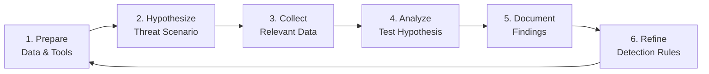

# Threat Hunting Methodology: Hypothesis-Driven Hunts

Threat hunting isn't "looking for bad things" — it's **structured hypothesis testing** against your environment. This methodology scales from solo analysts to dedicated hunt teams.

## The Hunting Loop



## Phase 1: Prepare — Know Your Data

Before hunting, map your **data source inventory**:

| Data Source | Coverage | Retention | Query Language | Use Case |
|-------------|----------|-----------|----------------|----------|
| **Sysmon** | Process, File, Net, Reg, DNS | 90 days | KQL / SPL | Endpoint visibility |
| **EDR** | Behavioral, Memory, MITRE tags | 1 year | Vendor API | Rich context |
| **Firewall/Proxy** | Netflow, DNS, HTTP | 1 year | KQL / SPL | Network hunting |
| **AD/Identity** | Auth, Kerberos, Group changes | 2 years | KQL / SPL | Identity threats |
| **Cloud (AWS/Azure/GCP)** | CloudTrail, Audit logs | 1 year | Cloud Query | Cloud hunting |

**Gap Analysis:** Which MITRE techniques lack data coverage?

```kql
// KQL: Find techniques with NO data source
let mitreTechniques = externaldata(technique:string, tactic:string) [@"https://..."] with (format="csv");
let coveredTechniques = Sysmon | summarize by Technique = tostring(MitreTechnique);
mitreTechniques | where technique !in (coveredTechniques) | project tactic, technique
```

## Phase 2: Hypothesize — Threat-Informed

**Good hypothesis:** Specific, testable, time-boxed.

| ❌ Bad Hypothesis | ✅ Good Hypothesis |
|-------------------|-------------------|
| "Find malware" | "APT29 uses `WMI` for lateral movement (T1047). Our Sysmon logs EventID 20 (WMI) — can we detect anomalous WMI consumer binding?" |
| "Look for suspicious PowerShell" | "FIN7 uses `Regsvr32` to execute COM scripts (T1218.010). Do we see `regsvr32.exe` with `/s /n /u /i:http` patterns?" |
| "Check for lateral movement" | "Adversaries use `Pass-the-Hash` (T1550.002). Can we detect NTLM auth with `LogonType=3` and `AuthenticationPackage=NTLM` where source != destination?" |

### Hypothesis Template

```markdown
## HUNT-2024-003: WMI Lateral Movement

**Threat Actor:** APT29 (Cozy Bear)
**Technique:** T1047 - Windows Management Instrumentation
**Data Source:** Sysmon EventID 20 (WMI Consumer Binding)
**Time Range:** Last 30 days
**Hypothesis:** APT29 creates permanent WMI event consumers for persistence. Legitimate WMI consumers are rare and follow naming conventions.

**Expected Indicators:**
- `Consumer` binding to `CommandLineEventConsumer` or `ActiveScriptEventConsumer`
- `Filter` with suspicious WQL queries (e.g., targeting `Win32_ProcessStartTrace`)
- `CreatorSID` not matching known admin accounts

**Success Criteria:**
- Identify 0 false positives in baseline
- Generate detection rule if hypothesis confirmed
```

## Phase 3: Collect — Query Development

### KQL (Microsoft Sentinel / Defender)

```kql
// WMI Consumer Binding (EventID 20)
let suspiciousConsumers = dynamic(["CommandLineEventConsumer", "ActiveScriptEventConsumer"]);
Sysmon
| where EventID == 20
| where Consumer in (suspiciousConsumers)
| parse ConsumerBinding with * "Filter=" Filter "Consumer=" Consumer *
| extend IsSuspicious = case(
    Filter has "Win32_ProcessStartTrace", true,
    Filter has "__InstanceCreationEvent", true,
    Filter has "TargetInstance ISA 'Win32_Process'", true,
    false
)
| where IsSuspicious == true
| project TimeGenerated, Computer, User, Filter, Consumer, CreatorSID
| join kind=leftouter (
    IdentityLogonEvents
    | where Timestamp > ago(30d)
    | summarize arg_max(Timestamp, *) by AccountSid
) on $left.CreatorSID == $right.AccountSid
| extend IsKnownAdmin = iff(AccountUpn in (~known_admins), true, false)
| where IsKnownAdmin == false
```

### Splunk SPL

```spl
# WMI Consumer Binding
index=sysmon EventCode=20
| where match(Consumer, "(CommandLineEventConsumer|ActiveScriptEventConsumer)")
| rex field=ConsumerBinding "Filter=(?<Filter>[^,]+).*Consumer=(?<Consumer>[^,]+)"
| where like(Filter, "%Win32_ProcessStartTrace%") OR like(Filter, "%__InstanceCreationEvent%")
| lookup known_admins CreatorSID AS AccountSid OUTPUT AccountUpn AS KnownAdmin
| where isnull(KnownAdmin)
| table _time, Computer, User, Filter, Consumer, CreatorSID
```

### Elastic DSL

```json
{
  "query": {
    "bool": {
      "filter": [
        { "term": { "event.code": 20 } },
        { "terms": { "winlog.event_data.Consumer": ["CommandLineEventConsumer", "ActiveScriptEventConsumer"] } },
        { "wildcard": { "winlog.event_data.Filter": "*Win32_ProcessStartTrace*" } }
      ],
      "must_not": [
        { "terms": { "winlog.event_data.CreatorSID": ["S-1-5-18", "S-1-5-19", "S-1-5-20"] } }
      ]
    }
  },
  "size": 100,
  "sort": [{ "@timestamp": { "order": "desc" } }]
}
```

## Phase 4: Analyze — Triage & Enrichment

### Triage Checklist

For each result:

1. **Context Enrichment**
   - Who is the user? (Admin? Service account? Compromised?)
   - What host? (Server? Workstation? Critical asset?)
   - What time? (Business hours? Off-hours? Maintenance window?)

2. **Behavioral Analysis**
   - Is this the first time this consumer appears?
   - Does the WQL query match known malicious patterns?
   - Is there related process execution (EventID 1) shortly after?

3. **Threat Intelligence**
   - IOC match on IPs, hashes, domains in the query?
   - ATT&CK technique match confidence?

### Enrichment Example

```kql
// Enrich with MITRE tags and TI
Sysmon
| where EventID == 20
| extend Technique = case(
    Consumer has "CommandLineEventConsumer", "T1047",
    Consumer has "ActiveScriptEventConsumer", "T1059.006",
    "Unknown"
)
| join kind=leftouter (
    ThreatIntelIndicators
    | where IndicatorType == "ipv4"
    | project IndicatorValue, ThreatType, Confidence
) on $left.DestinationIp == $right.IndicatorValue
| extend ThreatMatch = iff(isnotempty(ThreatType), true, false)
```

## Phase 5: Document — Hunt Report

### Report Template

```markdown
# Hunt Report: HUNT-2024-003

## Executive Summary
- **Hypothesis:** APT29 WMI lateral movement via permanent event consumers
- **Result:** 3 suspicious consumers identified, 1 confirmed malicious
- **Action:** Detection rule deployed, 1 host isolated for investigation

## Methodology
- **Data Source:** Sysmon EventID 20 (30 days)
- **Query:** [Link to saved query]
- **Time Range:** 2024-01-01 to 2024-01-31
- **Analyst:** @analyst-name

## Findings

| Host | User | Consumer Type | WQL Query | Verdict |
|------|------|---------------|-----------|---------|
| WKSTN-042 | jdoe | CommandLineEventConsumer | `SELECT * FROM Win32_ProcessStartTrace` | **Malicious** — Cobalt Strike beacon |
| SRV-007 | svc_sql | ActiveScriptEventConsumer | `__InstanceCreationEvent` | **Benign** — SQL monitoring script |
| DC-001 | admin | CommandLineEventConsumer | `TargetInstance ISA 'Win32_Service'` | **Benign** — Legitimate monitoring |

## Detection Rule Created

```yaml
title: Suspicious WMI Consumer Binding
id: wmi-suspicious-consumer
status: test
logsource:
  category: process_creation
  product: windows
detection:
  selection:
    EventID: 20
    Consumer|contains:
      - 'CommandLineEventConsumer'
      - 'ActiveScriptEventConsumer'
  filter_legit:
    CreatorSID|in:
      - 'S-1-5-18'  # SYSTEM
      - 'S-1-5-19'  # LOCAL SERVICE
      - 'S-1-5-20'  # NETWORK SERVICE
  condition: selection and not filter_legit
```

## Recommendations

1. **Immediate:** Block C2 IP on firewall, isolate WKSTN-042
2. **Short-term:** Deploy WMI consumer monitoring to all endpoints
3. **Long-term:** Implement WMI hardening (disable `winmgmt` where not needed)

## Lessons Learned

- Baseline legitimate WMI consumers *before* hunting
- Service accounts often create false positives — maintain allowlist
- Correlate with process creation (EventID 1) for full chain
```

## Phase 6: Refine — Detection as Code

Every hunt should produce **at least one** of:

1. **New detection rule** (Sigma/YARA)
2. **Improved existing rule** (reduced FP, added context)
3. **New data source** requirement
4. **Playbook/Runbook** update

### Automation: Hunt-to-Detection Pipeline

```python
# tools/hunt_to_detection.py
class HuntToDetection:
    def generate_sigma(self, hunt_findings: HuntReport) -> SigmaRule:
        rule = SigmaRule(
            title=f"Hunt: {hunt_findings.title}",
            id=str(uuid4()),
            status="test",
            logsource=hunt_findings.data_source,
            detection=self._build_detection(hunt_findings.indicators),
            tags=[f"attack.{t}" for t in hunt_findings.mitre_techniques],
            falsepositives=hunt_findings.false_positives,
            level="high",
            references=[hunt_findings.report_url]
        )
        return rule
```

## Continuous Hunting Program

| Cadence | Activity |
|---------|----------|
| **Daily** | Automated hunt queries (scheduled analytics) |
| **Weekly** | Analyst-led hypothesis hunt (2-4 hours) |
| **Monthly** | Threat-informed hunt (new TTPs from intel) |
| **Quarterly** | Purple team exercise (red + blue) |
| **Annually** | Methodology review, tool evaluation |

## Metrics That Matter

| Metric | Target |
|--------|--------|
| **Hunt coverage** | > 80% of MITRE techniques with ≥ 1 hunt/quarter |
| **Hypothesis confirmation rate** | 10-30% (too high = not hunting deep enough) |
| **Time to detection rule** | < 24 hours from confirmed finding |
| **False positive reduction** | 20% YoY from hunt-informed tuning |

---

*Hunting is not a one-time event. It's a continuous cycle of curiosity, rigor, and automation.*